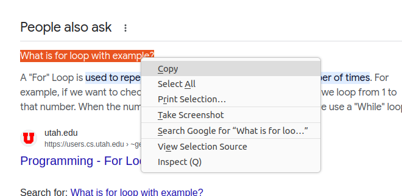
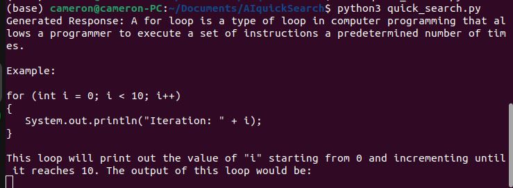

# Highlighted Text to ChatGPT

This Python application captures highlighted text from any application on Ubuntu and sends it to the ChatGPT API when a specific hotkey is pressed. The generated response from the API is then printed to the console.

## Prerequisites

- Python 3.6 or above
- `xclip` command-line tool
- `openai` library
- `pynput` library

## Installation

1. Clone the repository
2. pip install -r requirements.txt
3. Set up your OpenAI API credentials:

    Sign up for an account at OpenAI.
    Retrieve your API key.
    Replace 'YOUR_API_KEY' in the code with your actual API key.
   
## Usage

    Run the Python script:

    With any application open, highlight some text.

    Press the specified hotkey combination (<ctrl>+<alt>+h by default).

    The script will send the highlighted text to the ChatGPT API and print the generated response to the console.

## Customization

    You can change the hotkey combination by modifying the <ctrl>+<alt>+h part in the code.
    Modify the perform_action function to process the generated response according to your requirements.

## License

This project is licensed under the MIT License. See the LICENSE file for more details.

